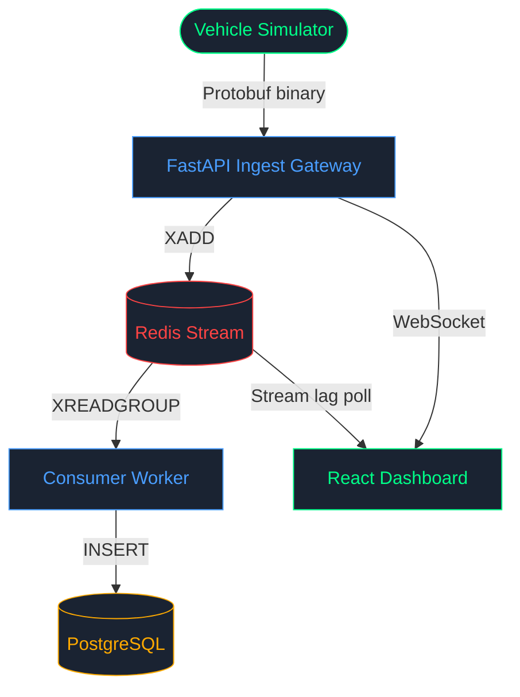

# Vehicle Sensor Telemetry Pipeline

A fault-tolerant ingestion pipeline for high-frequency binary sensor data from simulated
EV fleets, with a live React dashboard for monitoring and failure simulation.

**[CLICK HERE FOR LIVE DEMO!💻](https://edgelink-proxy.vercel.app)**


## Problem

Vehicles emit continuous sensor snapshots (speed, battery, motor temp, IMU) at high
frequency over unreliable networks. A naive HTTP pipeline drops messages during outages.
This system guarantees delivery using a durable stream buffer that replays unacknowledged
messages on consumer restart or network recovery.

## Architecture


## Key Design Decisions

- **Protobuf over JSON**: ~3x smaller payloads, strict schema, zero parsing ambiguity
- **Redis Streams**: consumer group semantics, persistent by default, simpler ops than Kafka at this scale
- **WebSocket push**: FastAPI broadcasts decoded snapshots to the dashboard in real-time
- **Backpressure**: ingest returns 503 when stream lag exceeds configured threshold
- **At-least-once delivery**: consumer ACKs only after confirmed DB write; XAUTOCLAIM handles stale pending entries on restart

## Dashboard Features

- Live sensor readings per vehicle (speed, battery %, motor temp, IMU)
- Stream lag graph — visualises buffer depth in real time
- Fault injection: pause/resume consumer from the UI and watch lag spike and self-heal
- Vehicle selector for per-device inspection

## Performance

Benchmarked with Locust simulating 50 concurrent vehicles:

| Scenario | Throughput | Median Latency | p95 Latency | Message Loss |
|---|---|---|---|---|
| 50 concurrent vehicles | 540 req/s | 14ms | 41ms | 0 |
| Network partition (30s) | buffered | — | — | 0 |
| Consumer restart | replayed | — | — | 0 |


## Run Locally
```bash
docker compose up
python simulator/run.py --vehicles 50 --hz 10
# Dashboard at http://localhost:3000
```

## Sensor Schema
```proto
message SensorSnapshot {
  string vehicle_id    = 1;
  int64  timestamp_ms  = 2;
  float  speed_ms      = 3;
  float  battery_pct   = 4;
  float  motor_temp_c  = 5;
  repeated float imu_accel = 6;  // [x, y, z]
}
```

## Failure Demo

Trigger a simulated network partition from the dashboard fault injection panel,
or via CLI:
```bash
docker compose stop consumer
python scripts/check_stream_lag.py  # watch lag accumulate
docker compose start consumer       # watch it drain, zero loss
```

## What I Learned

- End-to-end Protobuf serialization without framework scaffolding
- Redis Streams consumer group mechanics and failure recovery via XAUTOCLAIM
- Real-time data push via WebSockets bridging backend pipeline to React frontend
- Designing observable failure: the system degrades gracefully and self-heals

## Limitations & Future Improvements

The WebSocket broadcaster currently fans out every message to every connected client. At scale this would need per-vehicle pub/sub channels to avoid unnecessary traffic.

The consumer is a single worker. Horizontal scaling would require partition-aware consumer group coordination across multiple instances.

The ingest endpoint has no authentication. A production deployment would need mTLS or API key validation per device.

WebSocket client state lives in a Python list, which breaks across multiple FastAPI processes. A Redis pub/sub layer would be needed to scale the gateway horizontally.

Protobuf handles field additions gracefully but deletions are breaking changes. A schema registry would be required for a multi-team production environment.
